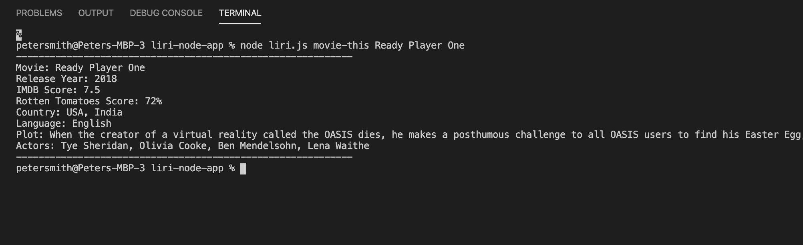

# LIRI Node App
Language Interpretation and Recognition Interface (LIRI)

## Overview

The LIRI (Language Interpretation and Recognition Interface) Node App is a search tool that enables the user to find information about movies, musical artists, songs, or upcoming concerts. It takes instructions from the Command Line and returns data relative to user input.


### Installation
1. Clone the GitHub repository to your computer
2. From the Command Line, navigate to `liri-node-app` (the LIRI root directory)
3. Install Node.js, which can be found here: https://nodejs.org/en/download/

4. Create API keys for Spotify via the [Spotify developer website](https://developer.spotify.com/)
5. Create your .env file
    ```
    touch .env
6. Add the following code to the .env file:
    ```
    # Spotify API Keys

    SPOTIFY_ID=your-key-here
    SPOTIFY_SECRET=your-secret-here
7. Install your node packages
    ```
    npm install
    ```

### Using LIRI
**NOTE:** You must be in the directory `liri-node-app` for LIRI to work properly.

Node | LIRI | Search Type | Query
------------ | ------------- |  ------------- | ------------- 
node | liri.js | movie-this | [movie]
node | liri.js | music-this | [song or artist]
node | liri.js | concert-this | [artist]
node | liri.js | party-time | null

**Sample LIRI query**



### Technologies

- Node.js
- axios
- dotenv API
- OMDB API
- Spotify API
- BandsinTown API
- Moment npm
